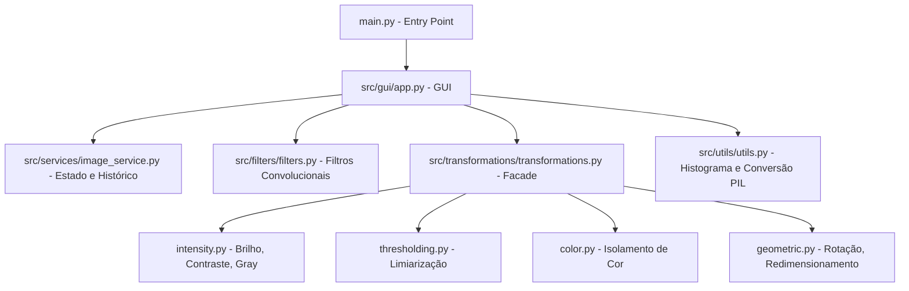

# Explicação Detalhada do Código Fonte - Processamento de Imagens

Este documento explica em detalhes a arquitetura, o funcionamento e o código completo do projeto de Processamento Digital de Imagens (PDI). O aplicativo foi estruturado com uma arquitetura modular que separa a interface gráfica (GUI), a gerência de estado (Service) e os algoritmos de transformação/filtragem.

---

## 1. Visão Geral da Arquitetura

O projeto adota uma arquitetura em camadas estruturada da seguinte forma:

---

## 2. Detalhamento dos Componentes e Código

### A. Ponto de Entrada: [main.py](file:///c:/Users/Jean/Documents/GitHub/processamento_de_imagem/main.py)
O arquivo [main.py](file:///c:/Users/Jean/Documents/GitHub/processamento_de_imagem/main.py) é o ponto de entrada da aplicação.
- Adiciona o diretório `src/` ao `sys.path` para permitir importações absolutas.
- Instancia a classe principal da interface gráfica `ImageApp` e inicia o loop principal do Tkinter (`app.mainloop()`).
- Contém tratamento de exceções global para capturar erros críticos de inicialização e exibir o rastreamento da pilha (`traceback`).

---

### B. Camada de Apresentação (GUI): [app.py](file:///c:/Users/Jean/Documents/GitHub/processamento_de_imagem/src/gui/app.py)
A interface gráfica é construída utilizando o `customtkinter` (uma extensão moderna do Tkinter com tema escuro e widgets aprimorados).

#### Principais Funcionalidades da Classe `ImageApp`:
1. **Esqueleto de Layout Dragável (`tk.PanedWindow`)**:
   - `self.main_pane`: Um divisor horizontal (`tk.PanedWindow`) que permite ao usuário arrastar a barra divisória para redimensionar a área de trabalho (esquerda) e o painel de propriedades (direita). Para manter o foco no canvas, a área lateral é configurada com `stretch="never"` e a área de imagem com `stretch="always"`.
   - `self.canvas_pane`: Um divisor vertical interno que separa o canvas da **Imagem Original** e o canvas do **Preview Processado**. Isso permite uma comparação lado a lado altamente responsiva.
2. **Gerenciador de Abas (`self.hud_panel` via `CTkTabview`)**:
   - `☀️ ADJUST`: Controles de Brilho, Contraste e Limiarização global/adaptativa.
   - `✨ FILTERS` (Reestruturado): Menu dropdown unificado para seleção de filtros com sliders dinâmicos, microcopias descritivas, checkbox de visualização ao vivo e botão de commit.
   - `🎨 COLOR`: Ajustes diretos (Cinza, Inversão, Equalização de Histograma) e ferramenta de isolamento de cor (criação de máscara HSV).
   - `📐 TRANSFORMS`: Rotação afim (com ou sem preservação de bordas) e escala geométrica.
   - `📜 HISTORY`: Histórico de passos, suporte a desfazer/refazer (Undo/Redo) e galeria de imagens locais predefinidas.
3. **Exibição e Atualização de Histograma**:
   - O método `update_histogram` calcula e plota as curvas de intensidade de cor (Vermelho, Verde, Azul ou canal único para Grayscale) em um widget `CTkCanvas` em tempo real.

---

### C. Serviço e Gerência de Estado: [image_service.py](file:///c:/Users/Jean/Documents/GitHub/processamento_de_imagem/src/services/image_service.py)
A classe `ImageService` atua como a única fonte de verdade sobre o estado das imagens na aplicação. Ela não interage diretamente com a interface, o que garante a separação de responsabilidades (baixo acoplamento).

- **`load_image(file_path)`**: Abre a imagem com o OpenCV, cria uma cópia de backup em `original_image` e inicializa a pilha de histórico.
- **Pilha de Histórico (Undo/Redo)**:
  - Mantém uma lista `self.history` de matrizes de imagens processadas e um ponteiro `self.history_index`.
  - Ao aplicar uma nova alteração, qualquer histórico "à frente" do índice atual é descartado (caso o usuário tenha feito Undo e depois aplicado outra alteração).
  - Limita o histórico a 20 passos em memória para economizar recursos de hardware (`len(self.history) > 20`).
- **`undo()`** / **`redo()`** / **`reset()`**: Manipula o índice da pilha de histórico, atualiza a imagem corrente e retorna a imagem correspondente.

---

### D. Algoritmos de Filtros: [filters.py](file:///c:/Users/Jean/Documents/GitHub/processamento_de_imagem/src/filters/filters.py)
Filtros espaciais que processam a imagem aplicando matrizes de convolução (Kernels).

1. **Gaussian Blur (`apply_gaussian_blur`)**:
   - Filtro de suavização linear. Reduz ruídos de alta frequência aplicando uma distribuição gaussiana sobre a vizinhança de pixels.
   - Parâmetros: `kernel_size` (garantido como número ímpar) e `sigma` (desvio padrão).
   - Função OpenCV utilizada: `cv2.GaussianBlur`.
2. **Median Blur (`apply_median_blur`)**:
   - Filtro de suavização não linear. Substitui o valor do pixel central pela mediana de todos os pixels sob a janela do kernel.
   - Extremamente eficaz na eliminação de ruídos de impulso (como ruído "sal e pimenta") sem borrar excessivamente as bordas.
   - Função OpenCV utilizada: `cv2.medianBlur`.
3. **Sobel Edges (`apply_sobel`)**:
   - Algoritmo de diferenciação espacial de primeira ordem. Calcula o gradiente de intensidade da imagem em direções verticais, horizontais ou ambas.
   - Utiliza a convolução com máscaras Sobel e faz a conversão de escala absoluta para evitar valores negativos (`cv2.convertScaleAbs`).
4. **Laplacian Edges (`apply_laplacian`)**:
   - Operador derivativo de segunda ordem. Destaca regiões de mudança rápida de intensidade de forma isotrópica (em todas as direções).
   - Converte para tons de cinza antes do processamento e gera bordas de alta frequência.

---

### E. Transformações de Imagem: [transformations.py](file:///c:/Users/Jean/Documents/GitHub/processamento_de_imagem/src/transformations/transformations.py)
Dividido em submódulos específicos para manter o código limpo:

1. **[intensity.py](file:///c:/Users/Jean/Documents/GitHub/processamento_de_imagem/src/transformations/intensity.py)**:
   - **Brilho e Contraste**: Multiplica a imagem por um fator de contraste $\alpha$ (alpha) e soma o ganho de brilho $\beta$ (beta).
     $$\text{Novo Pixel} = \text{Pixel} \times \alpha + \beta$$
     O código converte os pixels temporariamente para `float32` e utiliza `np.clip` para limitar os valores entre `0` e `255`, evitando estouro de canal de 8 bits antes de reconverter para `uint8`.
   - **Inversão**: Aplica a operação bitwise NOT (`cv2.bitwise_not`).
   - **Cinza**: Transforma de BGR para escala de cinza e depois replica o canal em 3 canais BGR para garantir consistência no pipeline gráfico.
   - **Equalização de Histograma**: Converte a imagem para o espaço de cor YUV, equaliza apenas o canal de luminância (Y) com `cv2.equalizeHist` e reconverte para BGR. Isso melhora o contraste mantendo as cores naturais.
2. **[thresholding.py](file:///c:/Users/Jean/Documents/GitHub/processamento_de_imagem/src/transformations/thresholding.py) (Limiarização/Binarização)**:
   - Suporta métodos globais (Binary, Binary Inverse, Truncate, To Zero, To Zero Inverse).
   - Suporta limiarização de **Otsu**, que calcula automaticamente o limiar ideal minimizando a variância intraclasse de pixels pretos e brancos.
   - Suporta limiarizações adaptativas (**Adaptive Mean** e **Adaptive Gaussian**), que determinam o limiar para cada pixel com base nas propriedades estatísticas da sua própria vizinhança circular de tamanho `block_size`.
3. **[color.py](file:///c:/Users/Jean/Documents/GitHub/processamento_de_imagem/src/transformations/color.py)**:
   - **Isolamento de Cor**: Converte a imagem para o espaço HSV (Hue, Saturation, Value) para isolar cores com base em intervalos angulares e de saturação. A cor selecionada é preservada e o restante da imagem é convertido para tons de cinza.
4. **[geometric.py](file:///c:/Users/Jean/Documents/GitHub/processamento_de_imagem/src/transformations/geometric.py)**:
   - **Redimensionamento (`apply_resize`)**: Redimensiona a imagem usando interpolação bilinear (`cv2.INTER_LINEAR`).
   - **Rotação Afim (`apply_rotation`)**: Calcula uma matriz de transformação de rotação em torno do centro da imagem (`cv2.getRotationMatrix2D`). 
     Se `keep_bounds` for ativo, calcula a nova largura e altura necessárias para conter a imagem rotacionada inteira através de funções trigonométricas de seno e cosseno, ajustando a matriz de translação para evitar cortes.
   - **Escalar (`apply_scale`)**: Escala a imagem multiplicando as coordenadas por fatores de escala X e Y.

---

## 3. Funções Utilitárias: [utils.py](file:///c:/Users/Jean/Documents/GitHub/processamento_de_imagem/src/utils/utils.py)
Funções de suporte para conversões de formato e otimização visual:
- **`cv2_to_pil(image)`**: Converte imagens OpenCV (representadas como matrizes NumPy em formato BGR ou Grayscale) para o formato `PIL.Image` em RGB. Trata de forma segura imagens de canal único para evitar falhas de conversão de ponteiros gráficos no Tkinter.
- **`calculate_histogram(image)`**: Calcula o número de ocorrências de cada tom (0 a 255) por canal usando a função `cv2.calcHist`.
- **`resize_to_fit(image, max_width, max_height)`**: Calcula a proporção de aspecto (aspect ratio) da imagem e redimensiona-a proporcionalmente para caber nos limites máximos do canvas sem distorcê-la.

---

## 4. Fluxo de Dados de Processamento (Exemplo Prático)

Para entender como as camadas interagem, veja o ciclo de vida da alteração do slider do filtro **Gaussian Blur** com o **Live Preview** ligado:

1. **Evento da Interface**: O usuário arrasta o controle deslizante de tamanho do kernel.
2. **Tratador de Eventos**: O método `on_filter_param_change` em `app.py` é disparado, lê o novo valor, atualiza o rótulo de texto (ex: `11`) e chama `apply_filters_live()`.
3. **Pipeline de Filtragem**: 
   - `apply_filters_live()` verifica se a checkbox do preview está marcada.
   - Obtém uma cópia do array da imagem atual guardada em `self.image_service.current_image`.
   - Chama a função `apply_gaussian_blur(img, kernel_size=11, sigma=...)` do módulo `filters.py`.
4. **Atualização da Tela**:
   - O array resultante é redimensionado por `resize_to_fit` em `utils.py` para caber na tela.
   - É convertido para imagem PIL por `cv2_to_pil` e depois em imagem do CustomTkinter (`CTkImage`).
   - O widget do canvas direito (`self.processed_canvas`) atualiza a exibição com a imagem processada.
5. **Confirmação (Commit)**:
   - Ao clicar em "COMMIT FILTER", o método `commit_filter_action()` executa a filtragem definitiva na imagem principal e envia a nova imagem para `self.image_service.update_current_image(img, add_to_history=True)`.
   - A pilha de histórico do serviço é atualizada, a interface limpa os seletores temporários e a nova imagem torna-se o novo ponto de partida estável da sessão.
